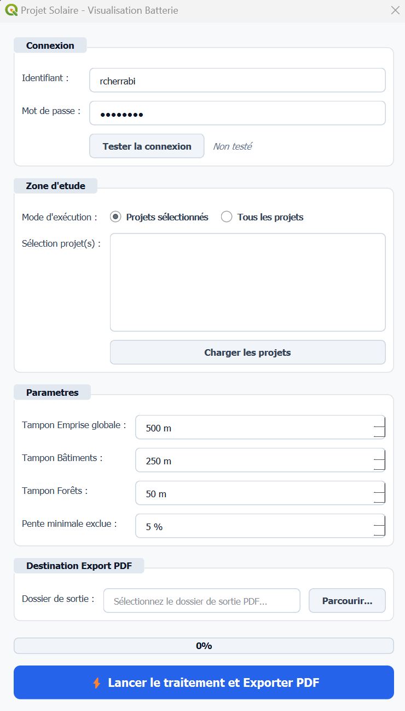

# 🔋 BESS Plugin — Analyse Spatiale pour Systèmes de Stockage

> **Extension PyQGIS d'automatisation multicritère pour l'identification des zones d'implantation de systèmes de stockage par batterie (BESS) et l'estimation de leur raccordement au réseau électrique.**

---

## 📌 Contexte & Enjeux stratégiques

L'intégration croissante des énergies renouvelables intermittentes accentue les déséquilibres sur le réseau électrique (fréquence de prix négatifs, effacements contraints de production). Face à l'évolution des appels d'offres de la CRE et aux exigences des contrats de vente directe (PPA), l'hybridation des parcs photovoltaïques avec des solutions de stockage par batterie (**BESS**) devient incontournable pour lisser l'injection en « peak load » et réduire les puissances de raccordement réservées.

Une installation BESS constitue un complexe technique dense :
* 📦 **Conteneurs de stockage électrochimique** ;
* ⚡ **Postes de conversion et de transformation** ;
* 🚒 **Équipements de sécurité incendie et de rétention environnementale**;
* 🚛 **Voiries lourdes pour engins de maintenance et de secours**.

Afin d'étudier l'adjonction de batteries sur l'ensemble d'un parc de centrales existantes sans surcharger le pôle SIG de calculs itératifs, cet outil automatise l'intégralité du pipeline d'analyse spatiale et de mise en page.

---

## ⚙️ Chaîne d'analyse spatiale & Contraintes réglementaires

Le plugin interroge directement la base de données spatiale de l'entreprise pour isoler l'emprise clôturée de la centrale cible, puis applique un filtrage strict :

* 🏘️ **Protection des tiers & acoustique (Tampon 250 m) :** exclusion stricte de 250 mètres autour des habitations pour prévenir les nuisances sonores générées par le refroidissement continu et sécuriser les riverains vis-à-vis des équipements haute tension.
* 🔥 **Prévention du risque incendie (Tampon 50 m) :** zone d'isolement de 50 mètres vis-à-vis de la BD Forêt IGN pour empêcher toute propagation croisée en cas de feu de végétation ou d'emballement thermique.
* 📐 **Contrainte topographique (Pentes faibles 0–1 %) :** calcul de pente sur Modèle Numérique de Terrain (MNT) pour limiter les travaux lourds de terrassement en déblai/remblai nécessaires aux dalles en béton armé.
* 🛡️ **Robustesse géométrique :** détection automatique et réparation instantanée des anomalies vectorielles (nœuds corrompus, auto-intersections) afin d'éviter tout plantage lors des opérations de découpage booléen.

---

## 🖥️ Console de pilotage

L'opérateur sélectionne le projet, paramètre les distances de tampons et lance la détection spatiale directement depuis une interface PyQt intégrée dans QGIS :

---

